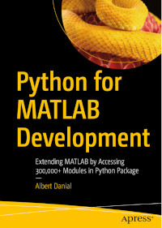

# Apress Source Code

This repository accompanies [*Python for MATLAB Development*](https://link.springer.com/book/10.1007/978-1-4842-7223-7) by Albert Danial (Apress, 2022).
The blog series
[Python is the Ultimate MATLAB Toolbox](https://al.danial.org/posts/python_is_the_ultimate_matlab_toolbox/)
will contain selections from the book.

[comment]: #cover

Download the files as a zip using the green button,
or clone the repository to your machine using Git.

## ``py2mat.m`` and ``mat2py.m``

MATLAB functions to convert arbitrary Python variables to
native MATLAB variables and vice versa can be found in the ``code`` directory:

* https://github.com/Apress/python-for-matlab-development/blob/main/code/matlab_py/py2mat.m
* https://github.com/Apress/python-for-matlab-development/blob/main/code/matlab_py/mat2py.m

## ``df2t.m`` and ``t2df.m``

Pandas dataframe to and from MATLAB table converters, conceptually
similar to ``py2mat.m`` and ``mat2py.m``, can be found at
Artem Lenskiy's [PandasToMatlab](https://github.com/Lenskiy/PandasToMatlab)
project.

## MATLAB Expo 2022

I gave a presentation, [Python for MATLAB Development](https://www.mathworks.com/videos/python-for-matlab-development-1653572942248.html),
(video, 24 minutes) on May 17 at the
[MATLAB Expo 2022](https://www.matlabexpo.com/online/2022/proceedings.html).

Slides and other files cited in the presentation can be found in
https://github.com/Apress/python-for-matlab-development/tree/main/matlab_expo_2022.

## Releases

Release v1.0 corresponds to the code in the published book,
without corrections or updates.

## Contributions

See the file Contributing.md for more information on how you can contribute to this repository.
